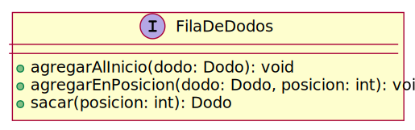
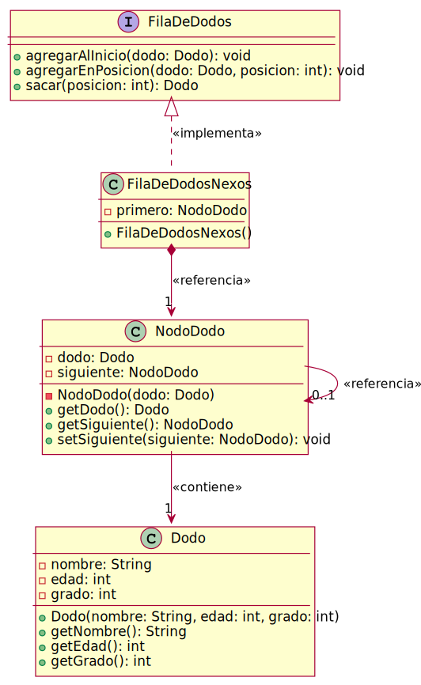

# Ayudantía VIII

Los pájaros **Dodos** ([Raphus cucullatus](https://en.wikipedia.org/wiki/Dodo)) se extinguieron aproximadamente cerca del año 1662. Se hicieron famosos a nivel mundial a partir de la película La era del Hielo.

Un grupo de investigadores del área de paleontología descubrieron dos hechos poco conocidos de los pájaros Dodos previos a su extinción:

1. Los pájaros Dodos amaban practicar el arte marcial coreano [Taekwondo](https://en.wikipedia.org/wiki/Taekwondo) y para ello se conocía su nombre, edad y grado (desde 10° kup a 1° kup). 
2. Los pájaros Dodos disfrutan muchísimo de comer [sandías](https://en.wikipedia.org/wiki/Watermelon).

Cuando los Dodos iban a practicar su arte marcial favorita se formaban y caminaban en fila india, es decir, uno detrás del otro.

A raíz que sus sesiones de entrenamiento son muy duras suele pasar que algunos de ellos pierden su lugar en la fila y se van quedando atrás, sin embargo, una vez que recuperan el aliento pueden regresar a su posición original en la fila.

Se pide construir una **[Lista con Nexo Simple](https://en.wikipedia.org/wiki/Linked_list)** que represente la fila de Dodos que tenga las siguientes opciones:

1. Ingresar un Dodo al final de la fila. 
2. Ingresar un Dodo en cualquier lugar de la fila. Se indica la posición. 
3. Eliminar un Dodo de la fila.

La evidencia de la construcción debe ser:
1. Diagrama de clases, incluyendo el uso de interfaces y lista implementada mediante Nodos. 
2. Código Java asociado al diagrama de clases.

## Diagrama de Clases inicial

## Diagrama de Clases de la solución

