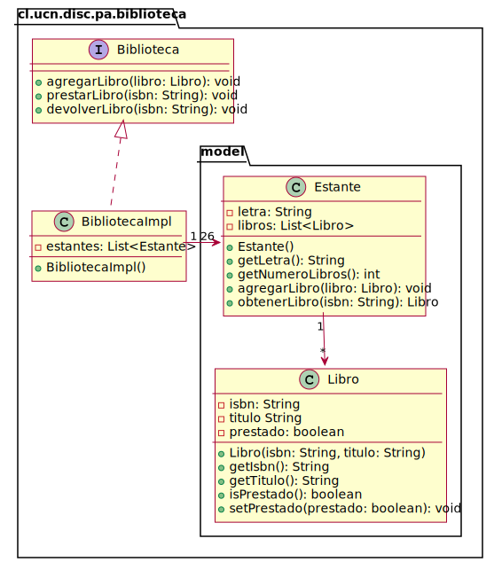

# Biblioteca UCN

La Universidad Católica del Norte desea crear un sistema digital para manejar los libros de la Biblioteca UCN.

La biblioteca está compuesta por diferentes estantes los cuales se diferencian por temática (Matemáticas, Lenguaje, Ciencias, Historia, Arte, Comic, Infantiles, etc.) y éstos contienen los diferentes libros de la biblioteca.

Un libro se caracteriza por poseer un título, un código alfanumérico (ISBN), una temática y una condición de “prestado” que indica si el libro se encuentra disponible o no.

El sistema debe:

* **Agregar Libros**: Implica crear el libro e ingresarlo al estante en el cual será guardado.
* **Prestar Libro**: Implica buscar el libro y cambiar el estado “prestado” si corresponde.
* **Devolver Libro**: Implica buscar el libro y cambiar el estado “prestado”.
* **Mostrar el estante más solicitado**: Implica saber que estante tiene más libros prestados.

## Diagrama de Clases de la solución

