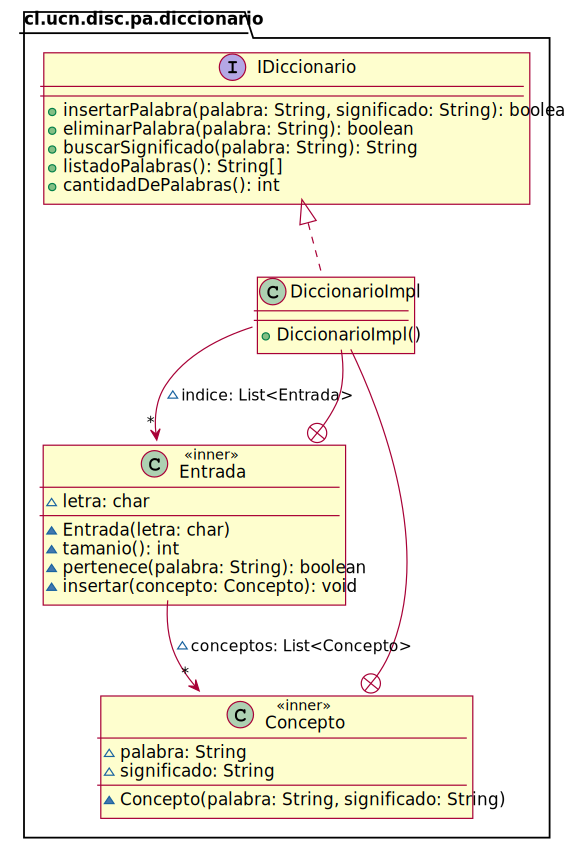

# Diccionario

* Una de las características más usadas de un computador, es su gran capacidad de leer y procesar información.
* Un ejemplo de ello son los diccionarios, donde se puede rápidamente encontrar el significado de una palabra.
* Existe un archivo llamado “diccionario.txt” que posee una gran cantidad de palabras (en desorden) y su significado.
* El formato de este archivo es: Palabra Significado, por ejemplo:

```text
Imán Cuerpo que atrae al hierro, bien por naturaleza, bien por propiedades adquiridas.
Labadismo Secta protestante pietista, fundada por Jean de Labadie.
Platicar Conversar, hablar unos con otros.
Kimono Túnica larga y amplia usada en Japón.
Pastaca Guiso de cerdo cocido con maíz.
```

* Se desea construir la clase DiccionarioImpl.java que almacene esta información a través de listas con nexos mediante el uso de la clase LinkedList de Java.

* Se pide:
    * Escribir el programa principal que cargue la información del archivo diccionario.txt en la clase DiccionarioImpl.java. 
    * Implemente la interface IDiccionario en la clase DiccionarioImpl.java. Además incluya el constructor.

## Diagrama de Clases de la Solución


