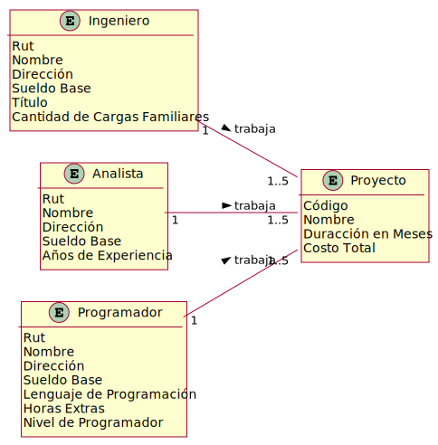
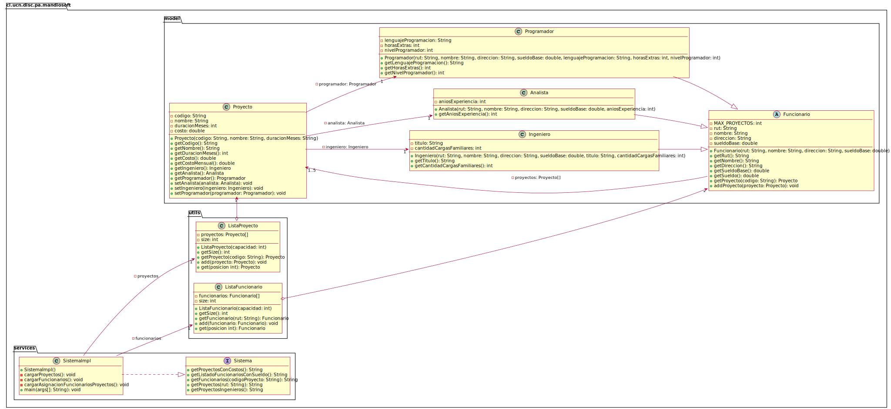

# Mandiosoft ltda.

* Se tiene información de los funcionarios de la empresa de computación Mandiosoft Ltda. en la cual se encuentra la información de cada uno de los 3 tipos de funcionarios del área de desarrollo de sistemas. Estos pueden ser Programadores, Analistas o Ingenieros.
* Todos los funcionarios tienen información en común, como lo es rut, nombre, dirección, sueldo base y el tipo de funcionario. Además si es programador interesa el lenguaje de programación que domina (sólo uno por programador), las horas extras y el nivel de programador (4: experto, 3: avanzado, 2: intermedio, 1: rookie). De los analistas además interesa saber los años de experiencia y finalmente de los ingenieros interesa el título y la cantidad de cargas familiares.
* La empresa Mandiosoft desarrolla proyectos para otras empresas, en cada uno de estos proyectos participa siempre 1 analista, 1 programador y 1 ingeniero. De cada proyecto interesa el nombre, el código, la duración en meses y su costo total.
* Los datos se leen de la siguiente manera:
  * Se tiene un archivo con los datos de todos los proyectos.
  * Se tiene un archivo con los datos de todos los funcionarios, donde en cada registro viene la información de un analista o de un ingeniero o de un programador. Cada registro debe indicar cuál de ellos es.
  * Se tiene un archivo con la asignación de los trabajadores a los proyectos.
  * Por cada registro viene el código del proyecto y el rut del funcionario.
* Los sueldos se calculan de la siguiente forma:
  * Para el programador además de su sueldo base, cada hora extra realizada cuesta $5000 además de un bono extra de $30000 por nivel y otro bono de 20% del valor total mensual del proyecto por cada proyecto en el que participa.
  * En el caso del analista su sueldo se calcula con el sueldo base más un bono de $5000 por cada año de experiencia más el 25% del valor total mensual del proyecto por cada proyecto en el que participa.
  * Finalmente el ingeniero recibe un sueldo base, más $8000 por cada carga familiar más un 30% del valor total mensual del proyecto por cada proyecto en el que participa.
* Suponga que cada funcionario trabaja a lo más en 5 proyectos.

Una vez ingresada la información, se necesita:

1. Listado de Proyectos con los costos involucrados (por meses y total)
2. Listado de funcionarios con sus respectivos sueldos. No es necesario desplegar los proyectos en los que participa.
3. Dado un proyecto entregar el listado de gente involucrada.
4. Dado un funcionario entregar el listado de proyectos en que participa.	
5. Para cada funcionario ingeniero, su nombre y su título.

Los archivos donde se encuentra la información son:

* Proyectos: mandiosoft_proyectos.dat
* Funcionarios: mandiosoft_funcionarios.dat
* Asociación entre Proyectos y Funcionarios: mandiosoft_proyectos_funcionarios.dat

## Domain Model

## Class Diagram

---
(c) 2022 Programación Avanzada, Departamento de Ingeniería de Sistemas y Computación, Universidad Católica del Norte, Antofagasta.
